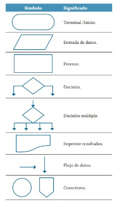

Inicio
Leer base, altura
Calcular área = (base * altura) / 2
Mostrar área
Fin


## Solucion
```
Inicio
Leer ID,S1,S2,S3,S4,S5,S6
TOTAL = S1+S2+S3+S4+S5+S6
Promedio = Total/6
Escribir ID, Total, Promedio
Fin
```
## Diagrama de flujo

## tarea
para la proxima clase traer ek osedicide d¿y el diagrana de flujo de:
curso de avuakua con 7 notas, conoce 6 noysd que equivalen al 70%, calcilar cuanto debo sacar en la evaluacion final para aprobar con 30
primero hacer el analisis , segundo el pseudocode y por ultimo y por ultimo el diagrana final en este markdown

## trabajo en clase
Realice un algoritmo para determinar cuánto se debe pagar por equis cantidad de lápices considerando que si son 1000 o más el costo es de $85 cada uno; de lo contrario, el precio es de $90. Represéntelo con el pseudocódigo y el diagrama de flujo.

|variables| tipo|comentarios|
|---------|-----|-----------|
|lapices|entrada|cantidad de lapices|
|precio|salida|valor unitario de cada lapiz|
|valor_unidad| intermedia|precio total de los lapices|
|85, 90|constantes|no cambian|

## pseudocodigo
``` 
inicio
leer lapices
si lapices>=1000:
    valor_unidad = 85
si no
    valor_unidad=90
fin si
precio = lapices * valor_unidad
escribir "el valor total es:", precio
fin
```
## Ejercicio 2
Un almacén de ropa tiene una promoción: por compras superiores a $250 000 se les aplicará un descuento de 15%, de caso contrario, sólo se aplicará un 8% de descuento. Realice un algoritmo para determinar el precio final que debe pagar una persona por comprar en dicho almacén y de cuántox es el descuento que obtendrá. Represéntelo mediante el pseudocódigo y el diagrama de flujo.

### Analisis
| variables | tipo | comentarios |
|-----------|------|-------------|
|total_compra| entrada| valor de la compra|
|descuento | salida | descuento segun el valor de la compra |
| precio_final | salida | valor a a pagar |
| 15%, 8% , $250000 | constantes| descuentos y valor limnite|
## pseudocodigo
```
inicio
leer total_compra
si total_compra> 250000:
    descuento = total_compra*0.15
si no
    Descuento = total_compra*0.08
fin si
precio_final= total_compra - descuento
Escribir "valor a pagar:", precio_final
fin
``` 

### Ejercicio 3 
El director de una escuela está organizando un viaje de estudios, y requiere determinar cuánto debe cobrar a cada alumno y cuánto debe pagar a la compañía de viajes por el servicio. La forma de cobrar es la siguiente: si son 100 alumnos o más, el costo por cada alumno es de $65.00; de 50 a 99 alumnos, el costo es de $70.00, de 30 a 49, de $95.00, y si son menos de 30, el costo de la renta del autobús es de $4000.00, sin importar el número de alumnos.
 
 ## Analisis
 | Variables | Tipos | Comentario |
 |-----------|--------|-----------|
 |Alumnos| entrada | cantidad de alumnos|
 |costo_alumno| salida | costo por cada alumno|
 |costo_total| salida | costo total que se debe pagar|
 |100 $65.00, 50-99 $70.00, 30-49 $95.00| constante| precio por cantidad de alumnos|
 |30 $4000.00| constante|costo de la renta por cantidad de alumnos|
## Pseudocodigo
```
inicio
leer alumnos
si alumnos >=100
    costo_alumno= $65
si no 
    si alumnos >=50
        costo_alumno= $70
    si no alumnos >=30
        costo_alumno= $95
    si no
        costo_total=$4000
        costo_alumno=costo_total / alumnos
    fin si

si alumnos>=30
    costo_total= costo_alumno*alumnos
fin si

escribir "el costo por alumno es:", costo_alumno
escribir "el costo total es:", costo_total
fin
```
# ejercicio en bucle
## pseudocodigo
```
inicio 
leer N
ceros = o
mayores = 0
menores = 0
mientras N > 0:
    leer cant
    si cant > 0:
        mayores = mayores + 1
    si no 
        si cant = 0:
            ceros = ceros + 1
        si no
            menores +=1
        fin si
    fin si
    N -= 1
fin mientras
mostrar ceros, mayores, menores
fin
```     

## pseudocodigo
```
inicio
    leer n
    i = 1
    resultado = 1
    si n = 0 
        resultado : 1
    fin si 
    si n > 0
        mientras i <= n
            resultado = resultado * i
            i = i + 1 
        fin mientras
    fin si 
    escribir "el factorial de", n, "es:" resultado
fin
n!*(n!-1)