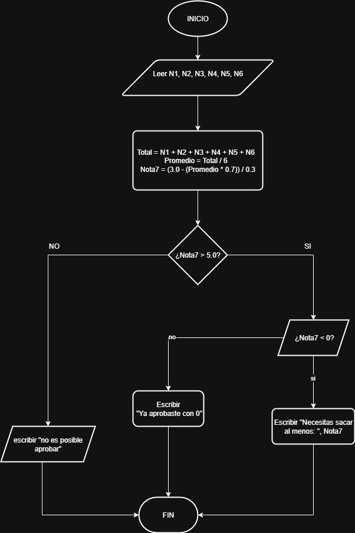
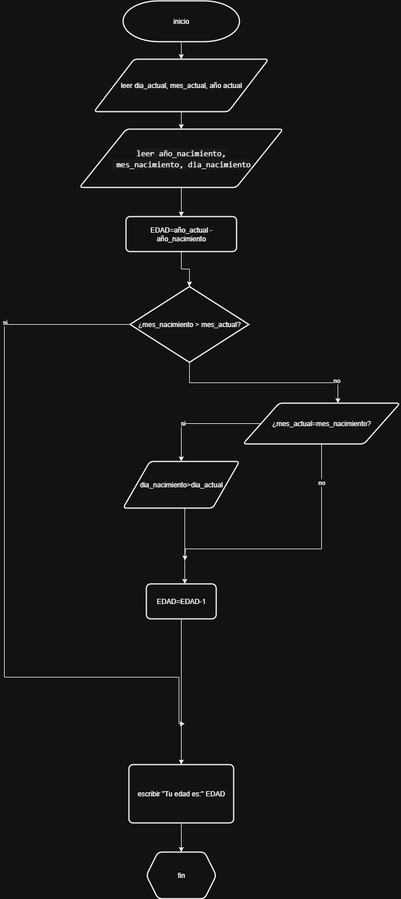

## calculo de notas
```
Inicio
Leer N1, N2, N3, N4, N5, N6
Total <- N1 + N2 + N3 + N4 + N5 + N6
Promedio <- Total / 6
Nota7 <- (3.0 - (Promedio * 0.7)) / 0.3

Si Nota7 > 5.0 Entonces
    Escribir "No es posible aprobar con las notas actuales"
Sino Si Nota7 < 0 Entonces
    Escribir "Ya aprobaste incluso si sacas 0"
Sino
    Escribir "Necesitas sacar al menos:", Nota7
FinSi
Fin
```



## calculo de edad
```
Inicio
leer dia_actual, mes_actual, año_actual
leer año_nacimiento, mes_nacimiento, dia_nacimiento

Obtener EDAD= año_actual - año_nacimiento
si mes_actual=<mes_nacimiento
    EDAD=EDAD-1
si no
    si mes_actual=mes_nacimiento y dia_actual<dia_nacimiento
    EDAD=EDAD-1
    fin si
fin si
escribir "tu edad es:"EDAD
```
